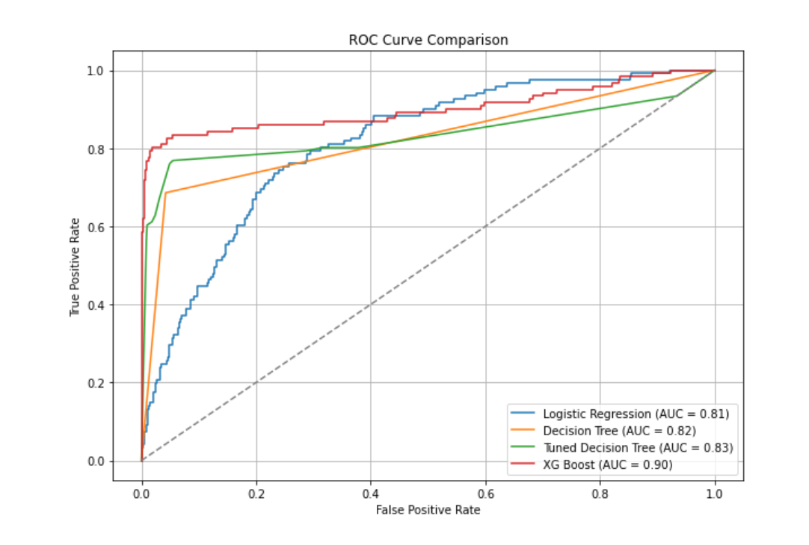

# Telecom Customer Churn Analysis

This project investigates customer churn for a telecom company using classification models. The primary objective is to identify factors that influence churn and build models that can predict whether a customer is likely to leave the company.

## Project Objectives

- Explore the dataset to understand churn trends.
- Preprocess and encode the data for machine learning.
- Train multiple classification models.
- Evaluate and compare models using various performance metrics.
- Identify the most influential features driving churn.
- Provide actionable recommendations to stakeholders.

---

## Dataset

The dataset includes customer-level features such as:

- Voice mail plan
- International plan
- Customer service calls
- Call minutes (day, evening, night, international)
- Number of voice mail messages

The target variable is `churn`, indicating whether the customer left the service.

---

## Models Used

1. **Logistic Regression**
2. **Untuned Decision Tree**
3. **Tuned Decision Tree**
4. **XGBoost Classifier**

---

## ROC Curve Comparison

The ROC curve below compares the performance of all models. A higher area under the curve (AUC) indicates better model performance in distinguishing between churners and non-churners.

---

## Feature Importance (Logistic Regression)

The following plot shows the top 10 most important features based on Logistic Regression coefficients.

Key influential factors:

- Having a voice mail plan
- Number of customer service calls
- Being on an international plan
- Number of voice mail messages
- Total day call minutes

---

## Recommendations

- **Improve customer service**: High customer service calls correlate with churn. Consider training agents and resolving issues faster.
- **Reevaluate international plans**: Customers on international plans are more likely to churn. Review pricing or offer better bundles.
- **Target customers with no voice mail plans**: They are more likely to churn; upselling could reduce churn.
- **Monitor high day-minute users**: Heavy users during the day tend to leave more; personalized plans may help retention.

---

## Conclusion

This analysis provides actionable insights for reducing churn. By focusing on the key drivers identified, the telecom company can improve customer retention and boost long-term revenue.
