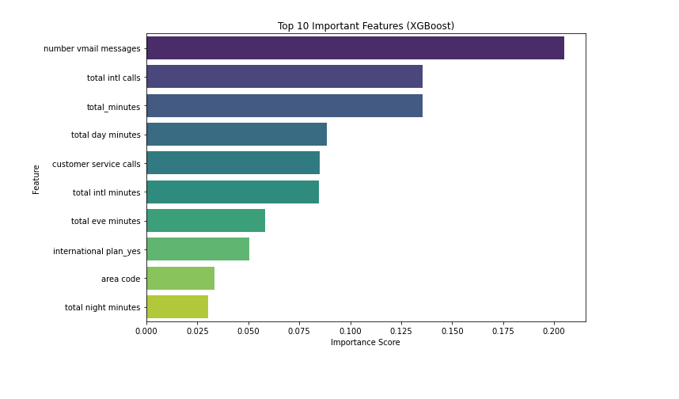

# Syria Telecom Customer Churn Analysis

This project focuses on predicting customer churn using a dataset from a telecommunications company. Churn prediction helps businesses identify customers likely to leave, enabling them to take proactive retention measures. The analysis covers data cleaning, exploratory data analysis (EDA), feature engineering, model building, evaluation, and interpretation of results.

## Problem Statement

The goal is to build a machine learning model that predicts whether a customer will churn (leave the service provider). Identifying such customers early allows the company to implement targeted interventions to retain them.

## Project Objectives

- Explore the dataset to understand churn trends.
- Preprocess and encode the data for machine learning.
- Train multiple classification models.
- Evaluate and compare models using various performance metrics.
- Identify the most influential features driving churn.
- Provide actionable recommendations to stakeholders.

---

## Dataset

The dataset includes customer-level features such as:

- Voice mail plan
- International plan
- Customer service calls
- Call minutes (day, evening, night, international)
- Number of voice mail messages

The target variable is `churn`, indicating whether the customer left the service.

---

## Models Used

1. **Logistic Regression**
2. **Untuned Decision Tree**
3. **Tuned Decision Tree**
4. **XGBoost Classifier**

---

## ROC Curve Comparison

The ROC curve below compares the performance of all models. A higher area under the curve (AUC) indicates better model performance in distinguishing between churners and non-churners.

---

## Feature Importance (Logistic Regression)

The following plot shows the top 10 most important features based on Logistic Regression coefficients.

Key influential factors:

- Having a voice mail plan
- Number of customer service calls
- Being on an international plan
- Number of voice mail messages
- Total day call minutes

---

## Recommendations

- Promote voicemail usage to boost customer engagement and reduce churn.

- Improve customer service to reduce dissatisfaction-driven churn.

- Re-evaluate international plans to address pricing or quality concerns.

- Use call behavior to segment users and tailor retention strategies.

- Design region-specific offers to address area-based churn trends.

---

## Conclusion

This analysis provides actionable insights for reducing churn. By focusing on the key drivers identified, the telecom company can improve customer retention and boost long-term revenue.
